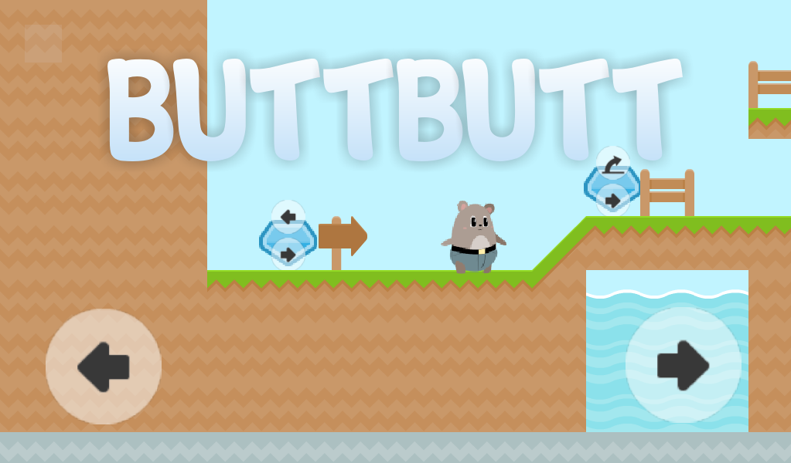
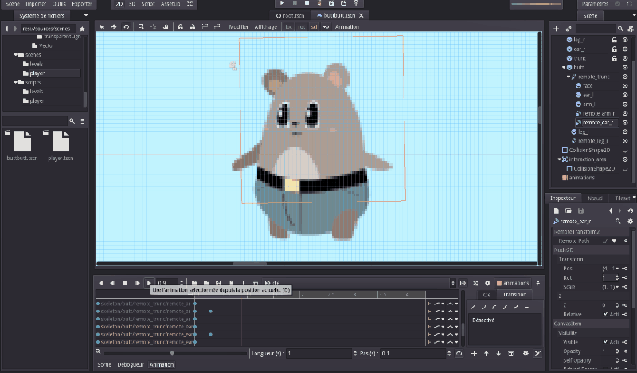
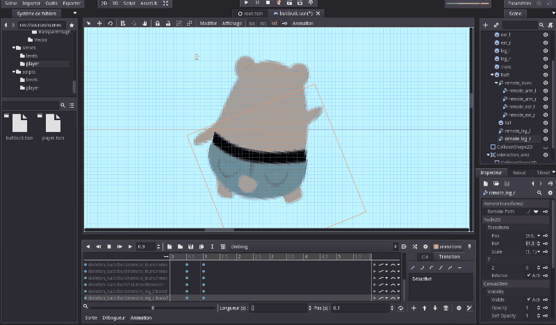

# ButtButt

____________________________
## Description

This game is like a good old platformer, but you can only use two actions. By passing through the "control changers", your 2 actions are replaced by 2 other actions.

You have to find the exit, by passing through those control changers.

You can download the game [here](https://non0w.itch.io/buttbutt)!

This was initially [my entry](https://itch.io/jam/godotjam122016/rate/116179) for the 2016-2017 Godot Game Jam. The theme was "two buttons".

____________________________
## Showcase

_____________________________
## Changelogs

### 0.2 changelog:
* change the icon
* add success screen
* add game over screen
* replace hud control sprites for running and jumping actions (still not perfect, ye* more intuitive)
* add a delay to jump after quitting the ground
* add touch-like controls for keyboards using page_up (left action) and page_dow* (right action) buttons
* make climbing stop when top of a ladder is reached
* add lateral direction control when jumping/falling
* rewrite entirely the players controls, it all feels smoother now
* add buttbutt assets and animations !!
* fix : when more than one touch detected on the right part of the screen, bot* controls are activated
* add a pause menu
* fix a level design flaw (could jump over a control changer and then jump to the en* of the level)
* fix title not being reset when going back to title screen
