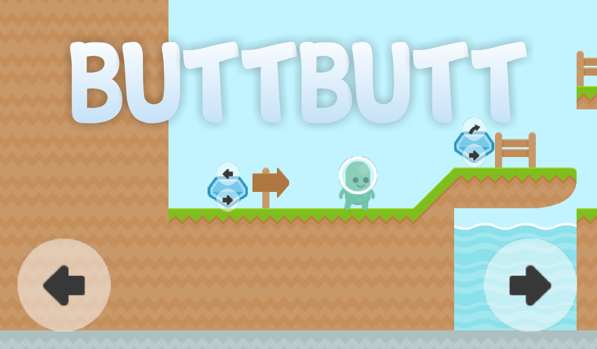
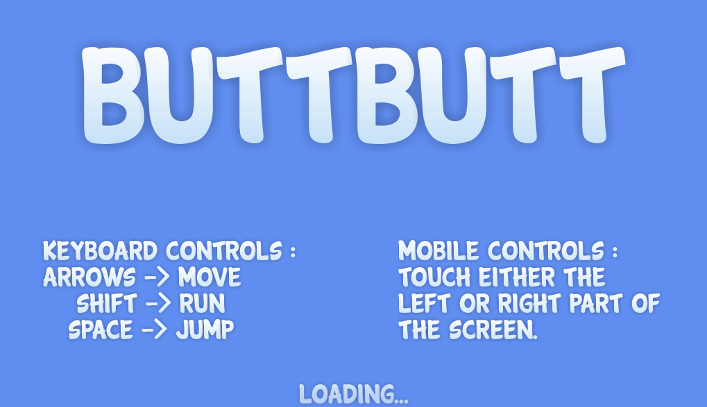
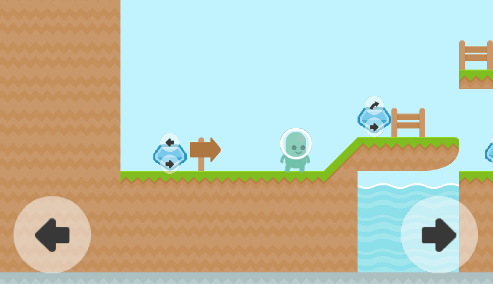
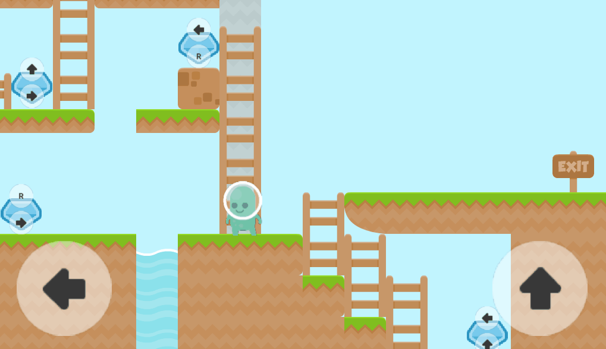

# ButtButt

____________________________

This is [my entry](https://itch.io/jam/godotjam122016/rate/116179) for the 2016-2017 Godot Game Jam. The theme was "two buttons".

This game is like a good old platformer, but you can only use two actions. By passing through the "control changers", your 2 actions are replaced by 2 other actions.

You have to find the exit, by passing through those control changers.

You can download and UPVOTE the game [here](https://itch.io/jam/godotjam122016/rate/116179)!

(For now the game is pretty short and there is no sound, it is more like a proof-of-concept than an actual game)
